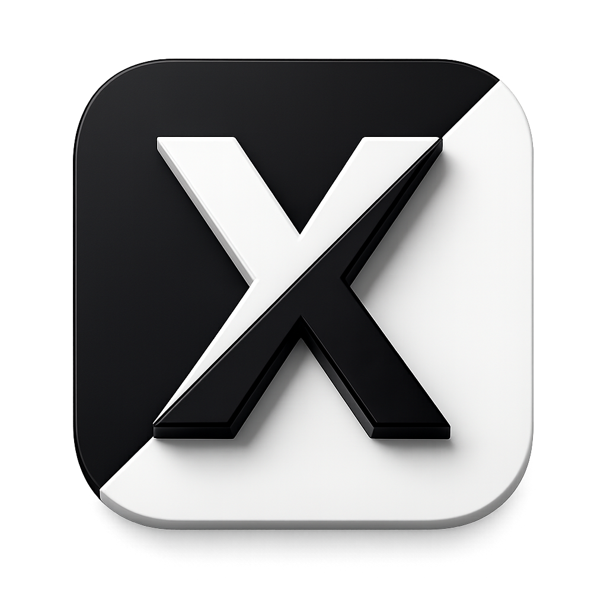
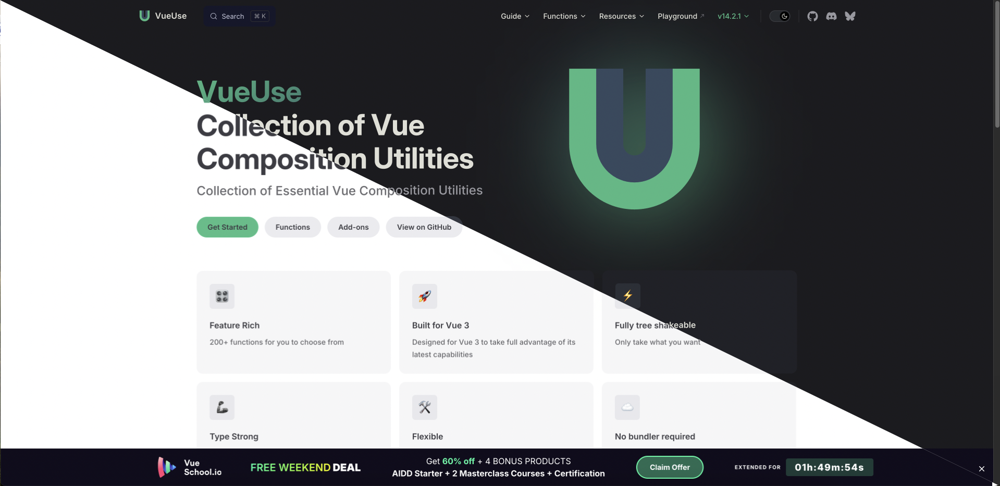

<p align="center">
  
</p>

<p align="center">
  <h1>📸 亮暗图拼接 - Swift 原生版</h1>
</p>
  
沿对角线拼接亮色/暗色两张截图的 macOS 原生应用。

> **本项目是 [electron-dark-light-joint](https://github.com/fxzer/electron-dark-light-joint) 的 Swift 原生重写版本，体积从 97MB 减少到 2.5MB。**

## ✨ 特点

- ✅ 原生 Swift实现
- ✅ 启动瞬间
- ✅ 内存占用低（~2MB）

## 📊 体积对比

| 方案 | 体积 |
|------|------|
| **Swift 原生（含图标）** | **~2.5MB** ⭐ |
| Swift 原生（无图标） | ~170KB |
| Electron 优化后 | ~93MB |
| Electron 原始 | ~97MB |

---

## 📥 安装

### 方法一：下载 Release（推荐）

[](https://github.com/fxzer/dark-light-joint/releases/download/v1.0.0/DarkLightJoint-macOS.zip)

1. 下载 [DarkLightJoint-macOS.zip](https://github.com/fxzer/dark-light-joint/releases/download/v1.0.0/DarkLightJoint-macOS.zip)
2. 解压并将 `DarkLightJoint.app` 拖到 `/Applications` 文件夹
3. 首次运行需要授予屏幕录制权限

### 方法二：从源码构建

```bash
# 克隆项目
git clone https://github.com/fxzer/dark-light-joint.git
cd dark-light-joint

# 构建应用
./build.sh        # 编译
./create_app.sh   # 创建 .app
./install.sh      # 安装到 /Applications（可选）
```

### 方法三：在 Xcode 中开发

1. 打开 Xcode
2. 创建新项目：**macOS > App**
3. 选择 **SwiftUI** 界面
4. 将以下文件拖入项目：
   - `DarkLightJointApp.swift`
   - `ContentView.swift`
5. 点击 **Run** 按钮

---

## 📖 使用方法

### 基本操作

1. **授权权限**：首次启动时，点击「授权」按钮，在系统设置中允许屏幕录制权限
2. **截图亮色模式**：点击左侧 📷 区域，选择要截取的亮色模式界面
3. **截图暗色模式**：点击右侧 📷 区域，选择要截取的暗色模式界面
4. **保存结果**：预览区会自动显示拼接结果，点击 **⬇️** 按钮保存

### 高级操作

- **删除截图**：点击截图右上角的红色 ❌ 按钮删除，重新截取
- **快速保存**：直接点击预览区任意位置快速保存

---

## 🎬 效果预览



---

## 📁 项目结构

```
dark-light-joint/
├── DarkLightJointApp.swift    # 应用入口
├── ContentView.swift          # 主界面和逻辑
├── build.sh                   # 构建脚本
├── create_app.sh              # 创建 .app 脚本
├── install.sh                 # 安装到 /Applications 脚本
├── icon.png                   # 应用图标源文件
├── AppIcon.iconset/           # 图标集目录
│   ├── icon_16x16.png
│   ├── icon_32x32.png
│   └── ...                    # 其他分辨率
├── AppIcon.icns               # macOS 图标文件
├── example.png                # 效果示例图
├── build/                     # 构建输出
│   ├── DarkLightJoint         # 可执行文件
│   └── DarkLightJoint.app     # 应用程序包
└── README.md                  # 本文件
```

---

## 🔧 重新构建

修改代码后：

```bash
./build.sh        # 重新编译
./create_app.sh   # 重新创建 .app
```

---

## ⚠️ 权限要求

首次运行时，macOS 可能会提示需要：

- **屏幕录制权限**：用于截图功能
- **文件访问权限**：用于保存图片

在 **系统设置 > 隐私与安全性** 中允许即可。

---

## 🔄 相关项目

### [browser-dark-light-screenshot](https://github.com/fxzer/browser-dark-light-screenshot) ⭐

如果你使用 **Claude Code**，还有对应的自动化 skill！

- 🚀 **全自动化**: 一句话命令自动打开网页、切换主题、截图、拼接
- 🤖 **AI 驱动**: 无需手动操作，Claude 会自动完成所有步骤
- 🎯 **完美集成**: 作为 Claude Code skill 使用，体验流畅

**对比:**

| 特性 | Swift 应用 | Claude Code Skill |
|------|-----------|-------------------|
| 操作方式 | 手动点击截图 | AI 自动化 |
| 使用场景 | 本地任意窗口 | 网页截图 |
| 学习成本 | 需要安装应用 | 需要配置 Claude Code |
| 灵活性 | 可截取任何界面 | 专注于网页 |

**使用示例:**
```
# 在 Claude Code 中
帮我生成 https://vuejs.org 的亮暗对比图
```

✨ 两个项目互补，满足不同需求！

---

## 🛠️ 开发环境要求

- macOS 13.0+
- Xcode 14.0+ （如果使用 Xcode）
- Swift 5.9+

---

## 🎨 自定义

### 修改窗口大小

在 `ContentView.swift` 中修改：

```swift
.frame(width: 1280, height: 400)
```

### 修改默认图片宽度

```swift
@State private var width: CGFloat = 360  // 改为你想要的大小
```

### 更换应用图标

1. 准备一个 1024x1024 的 PNG 图标文件，命名为 `icon.png`
2. 运行以下命令生成 .icns 文件：

```bash
# 创建图标集
mkdir -p AppIcon.iconset
sips -z 16 16 icon.png --out AppIcon.iconset/icon_16x16.png
sips -z 32 32 icon.png --out AppIcon.iconset/icon_16x16@2x.png
sips -z 32 32 icon.png --out AppIcon.iconset/icon_32x32.png
sips -z 64 64 icon.png --out AppIcon.iconset/icon_32x32@2x.png
sips -z 128 128 icon.png --out AppIcon.iconset/icon_128x128.png
sips -z 256 256 icon.png --out AppIcon.iconset/icon_128x128@2x.png
sips -z 256 256 icon.png --out AppIcon.iconset/icon_256x256.png
sips -z 512 512 icon.png --out AppIcon.iconset/icon_256x256@2x.png
sips -z 512 512 icon.png --out AppIcon.iconset/icon_512x512.png
sips -z 1024 1024 icon.png --out AppIcon.iconset/icon_512x512@2x.png

# 转换为 .icns
iconutil -c icns AppIcon.iconset

# 重新创建应用
./create_app.sh
```

---

